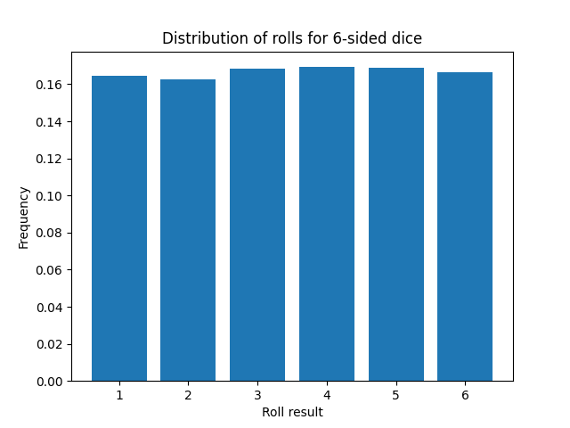

##  DiceForge Documentation v1.0.0

---

## 1. Introduction

Welcome to the documentation for DiceForge version 1.0.0! DiceForge is a powerful, easy-to-use API for rolling dice and generating random results for tabletop games, simulations, and other applications. With support for various dice configurations and roll types, DiceForge provides a flexible solution for your dice-rolling needs.

## 2. Getting Started

To get started with DiceForge, you will need to sign up for a FREE API key through RapidAPI. Once you have your API key, you can start making requests to the DiceForge endpoints.

Everyone can access up to 1000 rolls each month for FREE. Upgrade to the $1/mo Pro plan to get 100,000 rolls/month and access to pay-as-you-go overage, so you never hit a cap.

## 3. API Endpoints

DiceForge offers three main endpoints for rolling dice: [`/roll`](#31-roll--roll-dice) and [`/statroll`](#32-statroll--stat-roll) which supports both GET and POST requests, as well as [`/notation`](#33-notation--use-dice-notation) which only supports POST requests.

### 3.1. `/roll` – Roll Dice

The `/roll` endpoint allows you to roll one or more dice with various configurations, such as the number of sides, count, and modifiers. You can also apply advantage or disadvantage to the rolls.

#### 3.1.1. GET

To make a GET request, pass the following query parameters:

-   `sides`: An integer representing the number of sides for each die.
-   `count`: An integer representing the number of times each die should be rolled.
-   `modifier`: An integer representing the modifier to apply to each die's total.
-   `advantage`: A boolean indicating whether advantage should be applied to the rolls (default: false).
-   `disadvantage`: A boolean indicating whether disadvantage should be applied to the rolls (default: false).

The response will be a JSON object containing the results of the roll, including the dice configuration, individual roll results, and the total result.

```bash
GET /roll?sides=4&modifier=2&advantage=true
```

Response:

```json
{
    "dice": [
        {
            "sides": 4,
            "results": [
                {
                    "rolls": [2, 2],
                    "selected_roll": 2
                }
            ],
            "modifier": 2,
            "total": 4
        }
    ],
    "total": 4
}
```

#### 3.1.2. POST

To make a POST request, send a JSON payload with the following structure:

```json
{
  "dice": [
    {
      "sides": int,
      "count": int,
      "modifier": int
    },
    ...
  ],
  "advantage": boolean,
  "disadvantage": boolean
}
```

The response format is the same as for the GET request.

### 3.2. `/statroll` – Stat Roll

The `/statroll` endpoint is designed for rolling character stats, rolling 4 six-sided dice and dropping the lowest result.

#### 3.2.1. GET

To make a GET request, pass the following query parameter:

modifier: An integer representing the modifier to apply to the stat roll (default: 0).
The response format is the same as for the `/roll` endpoint.

#### 3.2.2. POST

To make a POST request, send an _optional JSON payload_ with the following structure:

```json
{
  "modifier": int
}
```

The response format is the same as for the GET request.

### 3.3. `/notation` – Use Dice Notation

The `/notation` endpoint allows users to pass a single input string in standard RPG Dice Notation format. It can contain several roll commands in one string, for example: `"2d6+12 1d20"`.

#### 3.3.1 POST

Request a roll using the RPG Dice Notation format in the request body.

Supports multiple dice deefinitions separated by a space.

`advantage` and `disadvantage` flags are available by ending your string with `!a` or `!d` respectively.

To make a POST request, send a JSON payload with the following structure:

```json
{
    "notation": str
}
```

The response format is the same as for the GET request.

## 4. Error Handling

In case of errors, DiceForge returns an HTTP status code of 400, along with a JSON object containing a descriptive error message. Common error cases include invalid parameter values, exceeding limits, or conflicting parameters.

## 5. Examples

### Here are some examples of requests and responses using DiceForge:

#### Roll one standard 6-sided die (GET)

```bash
GET /roll?sides=6
```

Response:

```json
{
    "dice": [
        {
            "sides": 6,
            "results": [3],
            "modifier": 0,
            "total": 3
        }
    ],
    "total": 3
}
```

#### Roll two 20-sided dice with advantage (POST):

```bash
POST /roll
{
  "dice": [
    {
      "sides": 20,
      "count": 2
    }
  ],
  "advantage": true
}
```

Response:

```json
{
    "dice": [
        {
            "sides": 20,
            "results": [
                {
                    "rolls": [13, 19],
                    "selected_roll": 19
                },
                {
                    "rolls": [7, 12],
                    "selected_roll": 12
                }
            ],
            "modifier": 0,
            "total": 31
        }
    ],
    "total": 31
}
```

#### Perform a stat roll (GET):

```bash
GET /statroll
```

Response:

```json
{
    "dice": [
        {
            "sides": 6,
            "results": [4, 5, 6, 1],
            "modifier": 0,
            "total": 15
        }
    ],
    "total": 15
}
```

#### Using standard RPG notation with 2 dice types and advantage (POST):

```bash
POST /notation
{
    "notation":"2d6+12 1d20 !a"
}
```

Response:

```json
{
    "dice": [
        {
            "sides": 6,
            "results": [
                {
                    "rolls": [6, 3],
                    "selected_roll": 6
                },
                {
                    "rolls": [6, 1],
                    "selected_roll": 6
                }
            ],
            "modifier": 12,
            "total": 24
        },
        {
            "sides": 20,
            "results": [
                {
                    "rolls": [19, 18],
                    "selected_roll": 19
                }
            ],
            "modifier": 0,
            "total": 19
        }
    ],
    "total": 43
}
```

## 6. Rate Limits

DiceForge has rate limits in place to ensure fair usage among all users. Please refer to the RapidAPI platform for specific rate limits associated with your subscription tier.

## 7. Support & Contact

For any questions or support requests, please contact Joe Peterson at [https://joepeterson.work/contact](https://joepeterson.work/contact).

## 8. Proofs of Randomness

### 1000 StatRolls



---

### 10d6 \* 100 rolls


---

### 10d20 \* 100 rolls


---

### 1000d20 performed three times


